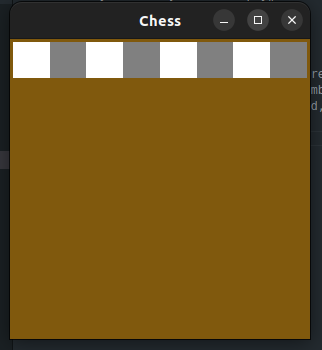
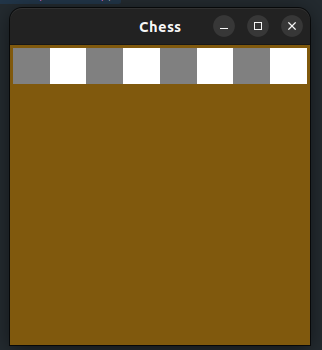
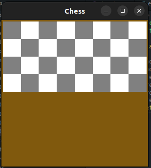
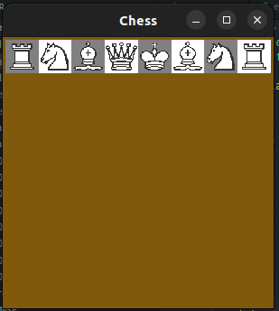
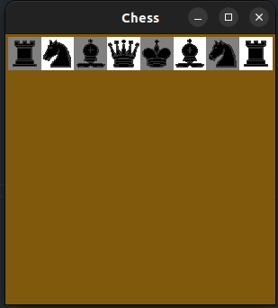
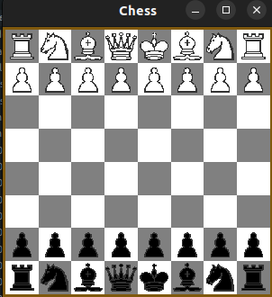

#PS_LABS
# INFORME DE LABORATORIO 04
<div align="center">
<table>
    <theader>
        <tr>
                <td style="width:50%; height:auto"></td>
            <th>
                <span style="font-weight:bold;">UNIVERSIDAD NACIONAL DE SAN AUGUSTIN</span><br />
                <span style="font-weight:bold;">FACULTAD DE INGENIERÍA DE PRODUCCIÓN Y SERVICIOS</span><br />
                <span style="font-weight:bold;">ESCUELA PROFESIONAL DE INGENIERÍA DE SISTEMAS</span>
            </th>
               <td></td>
                  </tr>
    </theader>
    <tbody>
        <tr><td colspan="3"><span style="font-weight:bold;">Formato</span>: Guía del Estudiante / Talleres / Centros de Simulación</td></tr>
        <tr><td><span style="font-weight:bold;">Aprobación</span>:  2022/03/01</td><td><span style="font-weight:bold;">Código</span>: GUIA-PRLD-001</td><td><span style="font-weight:bold;">Página</span>: 1</td></tr>
    </tbody>
</table>
</div>

<div align="center">
<span style="font-weight:bold;">GUÍA DEL ESTUDIANTE</span><br />
<span>(formato del estudiante)</span>
</div>


<table>
<theader>
<tr><th colspan="6">INFORMACIÓN BÁSICA</th></tr>
</theader>
<tbody>
<tr><td>ASIGNATURA:</td><td colspan="5">Programación de Sistemas</td></tr>
<tr><td>TÍTULO DE LA PRÁCTICA:</td><td colspan="5">Punteros</td></tr>
<tr>
<td>NÚMERO DE PRÁCTICA:</td><td>06</td><td>AÑO LECTIVO:</td><td>2022 A</td><td>NRO. SEMESTRE:</td><td>III</td>
</tr>
<tr>
<tr> <td>Tipo de Practica</td>
    <td>Individual</td><td>X</td>
        <td>Grupal</td><td>Maximo de estudiantes</td><td></td>
    </td> 
</tr>

<td>FECHA INICIO::</td><td>Jun-2022</td><td>FECHA FIN:</td><td>11-Jun-2022</td><td>DURACIÓN:</td><td>04 horas</td>
</tr>
<tr><td colspan="6">ALUMNO:
<ul>
<li>Cozco Mauri Yoset (ycozco@unsa.edu.pe)</li>
</ul>
</td>
</<tr>
<tr><td colspan="6">DOCENTES:
<ul>
<li> Edson Francisco Luque Mamani(eluquem@unsa.edu.pe)</li>
</ul>
</td>
</<tr>
</tdbody>
</table>


<table>
<theader>
<tr><th colspan="6">SOLUCIÓN Y RESULTADOS</th></tr>
</theader>
<tbody>
</tr>
<tr><td colspan="6">
<tr>

## I. SOLUCIÓN DE EJERCICIOS PROBLEMAS:
<br>
<tr>

-  **Ejercicio01:** Utilizando la función repeatH cree la siguiente figura, tenga en cuenta que se inicia con un casillero blanco.
    
```c
#include "chess.h"
#include "figures.h"

void display(){
  char** graySquare = reverse(whiteSquare);
  char** two_combo = join(graySquare,whiteSquare);
  char** reversed = reverse(two_combo);
  char** combined= repeatH(reversed,4); 
  interpreter(combined);
}
```
**resultado:** <br>


</tr>
<tr>

-  **Ejercicio02:** tilizando la función repeatH cree la siguiente figura, tenga en cuenta que se inicia con un casillero gris.
    
```c
#include "chess.h"
#include "figures.h"

void display(){
  char** graySquare = reverse(whiteSquare);
  char** two_combo = join(graySquare,whiteSquare);
  char** combined= repeatH(two_combo,4); 
  interpreter(combined);
}
```
**resultado:** <br>


</tr>

<tr> 

-   **Ejercicio03:** Usando libremente las funciones de la biblioteca, cree la siguiente figura: 
Ejercicio02 + Ejercicio01 Combinados x2:
        
```c
#include "chess.h"
#include "figures.h"

void display(){
  char** graySquare = reverse(whiteSquare);
  char** normal = join(graySquare,whiteSquare);
  char** normal2 = repeatH(normal,4);
  char** reversed = reverse(normal);
  char** reversed2 = repeatH(reversed,4);
  char** result= up(normal2,reversed2); 
  char** result2 = repeatV(result,2);
  interpreter(result2);
}
```

**resultado:** <br>


</tr><tr>

-   **Ejercicio04:**  Usando libremente las funciones de la biblioteca, cree la siguiente figura:
    Primera fila de ajedrez fichas blancas.

```c
#include "chess.h"
#include "figures.h"

void display(){
  char** graySquare = reverse(whiteSquare);
  char** casilla1 = join(graySquare,whiteSquare);
    char** repeat_c1 = repeatH(casilla1,4);
    char** rep_tab = repeatV(repeat_c1,2);

  char** rook_knight = join(rook,knight);
    char** bishop_queen = join(bishop,queen);
    char** king_bishop = join(king,bishop);
    char** knight_rook = join(knight,rook);
    char** m1 = join(rook_knight,bishop_queen);
    char** m2 = join(king_bishop,knight_rook);
    char** m3 = join(m1,m2);

  char** tab_01 = superImpose(m3,rep_tab);
    interpreter(tab_01);
}
```
**resultado:** <br>


</tr><tr>

-   **Ejercicio05:** Usando libremente las funciones de la biblioteca, cree la siguiente figura:
    Primera fila de ajedrez fichas negras.

```c
#include "chess.h"
#include "figures.h"

void display(){
  char** graySquare = reverse(whiteSquare);
    char** casilla1 = join(graySquare,whiteSquare);
    char** repeat_c1 = repeatH(casilla1,4);
    char** rep_tab = repeatV(repeat_c1,2);

  char** rook_inv = reverse(rook);
    char** knight_inv = reverse(knight);
    char** bishop_inv = reverse(bishop);
    char** queen_inv = reverse(queen);
    char** king_inv = reverse(king);

  char** rook_knight = join(rook_inv,knight_inv);
    char** bishop_queen = join(bishop_inv,queen_inv);
    char** king_bishop = join(king_inv,bishop_inv);
    char** knight_rook = join(knight_inv,rook_inv);
    char** m1 = join(rook_knight,bishop_queen);
    char** m2 = join(king_bishop,knight_rook);
    char** m3 = join(m1,m2);

  char** tab_01 = superImpose(m3,rep_tab);
    interpreter(tab_01);
}
```
**resultado:** <br>


</tr>

-   **Ejercicio06:** Usando libremente las funciones de la biblioteca, cree un tablero de ajedrez completo:

```c
#include "chess.h"
#include "figures.h"

void display(){
char** graySquare = reverse(whiteSquare);

char** casilla1 = join(graySquare,whiteSquare);
char** repeat_c1 = repeatH(casilla1,4);
char** rep_tab = repeatV(repeat_c1,2);

char** rook_knight = join(rook,knight);
char** bishop_queen = join(bishop,queen);
char** king_bishop = join(king,bishop);
char** knight_rook = join(knight,rook);
char** m1 = join(rook_knight,bishop_queen);
char** m2 = join(king_bishop,knight_rook);
char** m3 = join(m1,m2);

char** tab_white_01 = superImpose(m3,rep_tab);

char** rep_tab2 = reverse(rep_tab);
char** list_pawn_1 = join(pawn,pawn);
char** list_pawn_2 = repeatH(list_pawn_1,4);
char** list_pawn_3 = superImpose(list_pawn_2,rep_tab2);

char** tab_white_02 = up(tab_white_01,list_pawn_3);


char** normal = join(graySquare,whiteSquare);
char** normal2 = repeatH(normal,4);
char** reversed = reverse(normal);
char** reversed2 = repeatH(reversed,4);
char** result= up(normal2,reversed2); 
char** middle = repeatV(result,2);

  char** rep_tab3 = reverse(rep_tab2);
    char** pawn_rev = reverse(pawn);
    char** list_pawn_black_1 = join(pawn_rev,pawn_rev);
    char** list_pawn_black_2 = repeatH(list_pawn_black_1,4);
    char** list_pawn_black_3 = superImpose(list_pawn_black_2,rep_tab3);

  char** tab_black_01 = reverse(tab_white_01);
    char** tab_black_02 = up(list_pawn_black_3,tab_black_01);

  char** general = up(middle,tab_black_02);
    char** general_2 = up(tab_white_02,general);

interpreter(general_2);

}
```
**resultado:** <br>


</tr>

</td>
<tr><td colspan="6">II. SOLUCIÓN DE CUESTIONARIO: <br>

- 

</tr>
</tr>
<tr><td colspan="6">III. CONCLUSIONES:

</tr>

</tdbody>
</table>


<table>
<theader>
<tr><th colspan="6">RETROALIMENTACIÓN GENERAL</th></tr>
</theader>
<tbody>
</tr>
<tr><td colspan="6">
<ul>
<li><a </a></li>
<li><a </a></li>
<li><a </a></li>
</ul>
</td>
</<tr>
</tdbody>
</table>


<table>
<theader>
<tr><th colspan="6">REFERENCIAS BIBLIOGRÁFICAS</th></tr>
</theader>
<tbody>
</tr>
<tr><td colspan="6">
<ul>


<li></li>
</ul>
</td>
</<tr>
</tdbody>
</table>


